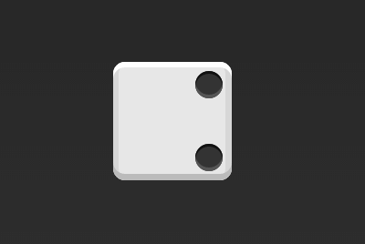

### 实例篇

#### 骰子的布局

看看Flex如何实现，从1个点到9个点的布局。
```html
<div class="box">
    <span class="item"></span>
</div>
```
上面代码中，`div`元素（代表骰子的一面）是`Flex`容器，`span`元素（代表一个点）是`Flex`项目。

1. 单项目
首先，只有左上角1个点的情况。**Flex布局默认就是首行左对齐**，所以一行代码就够了。


```css
.box {
    display: flex;
    justify-content: flex-start;
}
```
设置项目的对其方式，就能实现剧中对其和右对齐


```css
.box {
    display: flex;
    justify-content: center;
}
```


```css
.box {
    display: flex;
    justify-content: flex-end;
}
```

设置交叉轴对齐方式，可以垂直移动主轴。


```css
.box {
    display: flex;
    justify-content: flex-start;
    align-items: center;
}
```


```css
.box {
    display: flex;
    justify-content: center;
    align-items: center;
}
```


```css
.box {
    display: flex;
    justify-content: content;
    align-items: flex-end;
}
```


```css
.box {
    display: flex;
    justify-content: flex-end;
    align-items: flex-end;
}
```

2. 双项目
---


```css
.box {
    display: flex;
    justify-content: space-between;
}
```


```css
.box {
    display: flex;
    flex-direction: column;
    justify-content: space-between;
}
```


```css
.box {
    display: flex;
    flex-direction: column;
    justify-content: space-between;
    align-items: center;
}
```



```css
.box {
    display: flex;
    flex-direction: column;
    justify-content: space-between;
    align-items: flex-end;
}
```


3. 三项目
---

4. 
