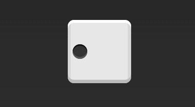
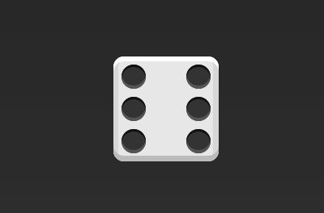
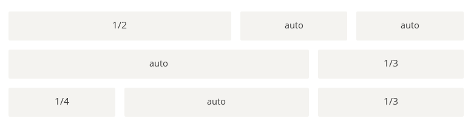

### 实例篇

#### 骰子的布局

看看Flex如何实现，从1个点到9个点的布局。
```html
<div class="box">
    <span class="item"></span>
</div>
```
上面代码中，`div`元素（代表骰子的一面）是`Flex`容器，`span`元素（代表一个点）是`Flex`项目。

1. 单项目
首先，只有左上角1个点的情况。**Flex布局默认就是首行左对齐**，所以一行代码就够了。


```css
.box {
    display: flex;
    justify-content: flex-start;
}
```
设置项目的对其方式，就能实现剧中对其和右对齐


```css
.box {
    display: flex;
    justify-content: center;
}
```


```css
.box {
    display: flex;
    justify-content: flex-end;
}
```

设置交叉轴对齐方式，可以垂直移动主轴。



```css
.box {
    display: flex;
    justify-content: flex-start;
    align-items: center;
}
```


```css
.box {
    display: flex;
    justify-content: center;
    align-items: center;
}
```


```css
.box {
    display: flex;
    justify-content: content;
    align-items: flex-end;
}
```


```css
.box {
    display: flex;
    justify-content: flex-end;
    align-items: flex-end;
}
```

2. 双项目
---


```css
.box {
    display: flex;
    justify-content: space-between;
}
```


```css
.box {
    display: flex;
    flex-direction: column;
    justify-content: space-between;
}
```


```css
.box {
    display: flex;
    flex-direction: column;
    justify-content: space-between;
    align-items: center;
}
```


```css
.box {
    display: flex;
    flex-direction: column;
    justify-content: space-between;
    align-items: flex-end;
}
```


```css
.box {
    display: flex;
}

.item:nth-child(2) {
    align-self: center;
}
```


```css
.box {
    display: flex;
    justify-content: space-between;
}

.item:nth-child(2) {
    align-self: flex-end;
}
```

3. 三项目
---


```css
.box {
    display: flex;
}

.item:nth-child(2) {
    align-self: center;
}

.item:nth-child(3) {
    align-self: flex-end;
}
```
4. 四项目
---


```css
.box {
    display: flex;
    flex-wrap: wrap;
    justify-content: flex-end;
    align-content: space-between;
}
```


HTML代码如下：
```html
<div class="box">
    <div class="column">
        <span class="item"></span>
        <span class="item"></span>
    </div>
    <div class="column">
        <span class="item"></span>
        <span class="item"></span>
    </div>
</div>
```
CSS代码如下：
```css
.box {
    display: flex;
    flex-wrap: wrap;
    align-content: space-between;
}
.column {
    flex-basis: 100%;
    display: flex;
    justify-content: space-between;
}
```
5. 六项目
---


```css
.box {
    display: flex;
    flex-wrap: wrap;
    align-content: space-between;
}
```


```css
.box {
    display: flex;
    flex-direction: column;
    flex-wrap: wrap;
    align-content: space-between;
}
```


HTML代码如下：
```html
<div class="box">
    <div class="row">
        <span class="item"></span>
        <span class="item"></span>
        <span class="item"></span>
    </div>
    <div class="row">
        <span class="item"></span>
    </div>
    <div class="row">
        <span class="item"></span>
        <span class="item"></span>
    </div>
</div>
```

CSS代码如下：
```css
.box {
    display: flex;
    flex-wrap: wrap;
}
.row {
    display: flex;
    flex-basis: 100%;
}
.row:nth-child(2) {
    justify-content: center;
}
.row:nth-child(3) {
    justify-content: space-between;
}
```

6. 九项目
---


```css
.box {
    display: flex;
    flex-wrap: wrap;
}
```

#### 网格布局
1. 基本网格布局
---
最简单的网格布局，就是平均分布。在容器里面平均分配空间，跟上面的骰子布局很像，但是需要设置项目的自动缩放。


HTML代码如下：
```html
<div class="Grid">
    <div class="Grid-cell">...</div>
    <div class="Grid-cell">...</div>
    <div class="Grid-cell">...</div>
</div>
```
CSS代码如下：
```css
.Grid {
  display: flex;
}

.Grid-cell {
  flex: 1;
}
```

2. 百分比布局
---
某个网格的宽度为固定的百分比，其余网格平均分配剩余的空间。


HTML代码如下：
```html
<div class="Grid">
    <div class="Grid-cell u-1of4">...</div>
    <div class="Grid-cell">...</div>
    <div class="Grid-cell u-1of3">...</div>
</div>
```
```css
.Grid {
    display: flex;
}

.Grid-cell {
    flex: 1;
}

.Grid-cell.u-full {
    flex: 0 0 100%;
}

.Grid-cell.u-1of2 {
    flex: 0 0 50%;
}

.Grid-cell.u-1of3 {
    flex: 0 0 33.3333%;
}

.Grid-cell.u-1of4 {
    flex: 0 0 25%;
}
```

#### 圣杯布局

[圣杯布局](https://en.wikipedia.org/wiki/Holy_Grail_(web_design))（Holy Grail Layout）指的是一种最常见的网站布局。页面从上到下，分成三个部分：头部（header），躯干（body），尾部（footer）。其中躯干又水平分成三栏，从左到右为：导航、主栏、副栏。


HTML代码如下：
```html
<body class="HolyGrail">
    <header>...</header>
    <div class="HolyGrail-body">
        <main class="HolyGrail-content">...</main>
        <nav class="HolyGrail-nav">...</nav>
        <aside class="HolyGrail-ads">...</aside>
    </div>
    <footer>...</footer>
</body>
```

CSS代码如下：
```css
.HolyGrail {
    display: flex;
    min-height: 100vh;
    flex-direction: column;
}

header,
footer {
    flex: 1;
}

.HolyGrail-body {
    display: flex;
    flex: 1;
}

.HolyGrail-content {
    flex: 1;
}

.HolyGrail-nav, .HolyGrail-ads {
    /* 两个边栏的宽度设为12em */
    flex: 0 0 12em;
}

.HolyGrail-nav {
    /* 导航放到最左边 */
    order: -1;
}
```

如果是小屏幕，躯干的三栏自动变为垂直叠加。
```css
@media (max-width: 768px) {
    .HolyGrail-body {
        flex-direction: column;
        flex: 1;
    }
    .HolyGrail-nav,
    .HolyGrail-ads,
    .HolyGrail-content {
        flex: auto;
    }
}
```

#### 输入框的布局
---


HTML代码如下：
```html
<div class="InputAddOn">
    <span class="InputAddOn-item">...</span>
    <input class="InputAddOn-field">
    <button class="InputAddOn-item">...</button>
</div>
```

```css
.InputAddOn {
    display: flex;
}

.InputAddOn-field {
    flex: 1;
}
```

#### 悬挂式布局
---
主栏的左侧或右侧，需要添加一个图片栏。


HTML代码如下：
```html
<div class="Media">
    
    <p class="Media-body">...</p>
</div>
```

CSS代码如下：
```css
.Media {
    display: flex;
    align-items: flex-start;
}

.Media-figure {
    margin-right: 1em;
}

.Media-body {
    flex: 1;
}
```

#### 固定的底栏
---
页面内容太少，无法占满一屏的高度，底栏就会抬高到页面的中间。这时可以采用Flex布局，让底栏总是出现在页面的底部。


HTML代码如下：
```html
<body class="Site">
    <header>...</header>
    <main class="Site-content">...</main>
    <footer>...</footer>
</body>
```

CSS代码如下：
```css
.Site {
    display: flex;
    min-height: 100vh;
    flex-direction: column;
}

.Site-content {
    flex: 1;
}
```

#### 流式布局
---
每行的项目数固定，会自动分行。


```css
.parent {
    width: 200px;
    height: 150px;
    background-color: black;
    display: flex;
    flex-flow: row wrap;
    align-content: flex-start;
}

.child {
    box-sizing: border-box;
    background-color: white;
    flex: 0 0 25%;
    height: 50px;
    border: 1px solid red;
}
```