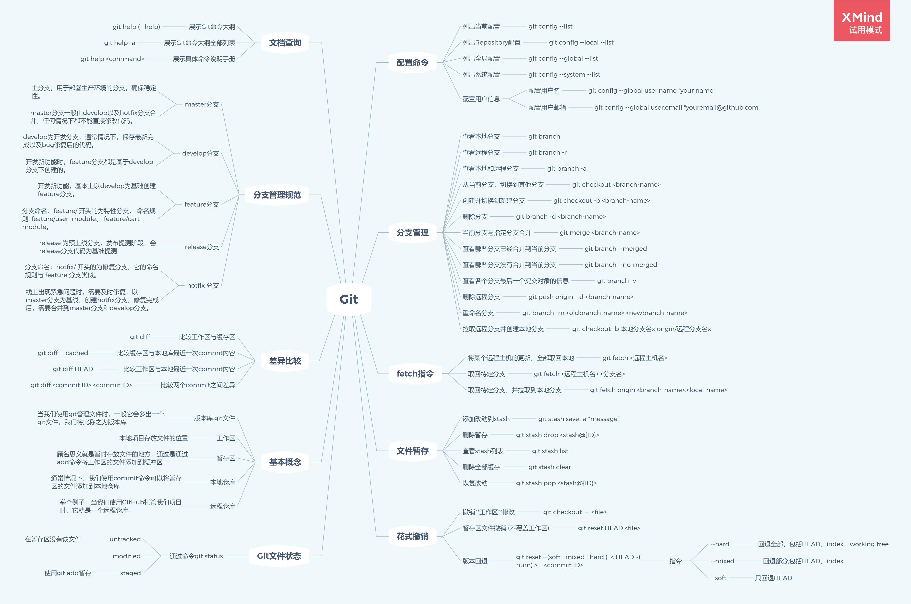
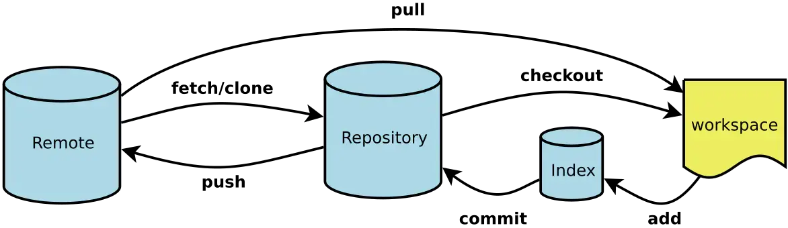
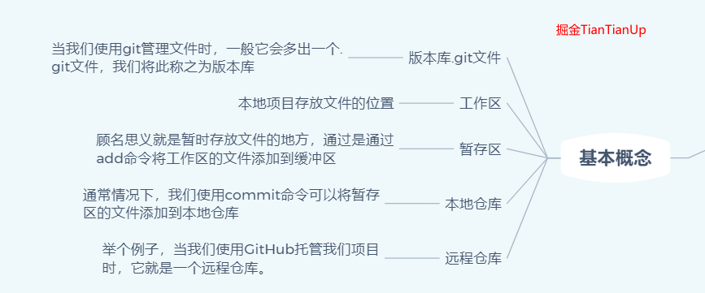
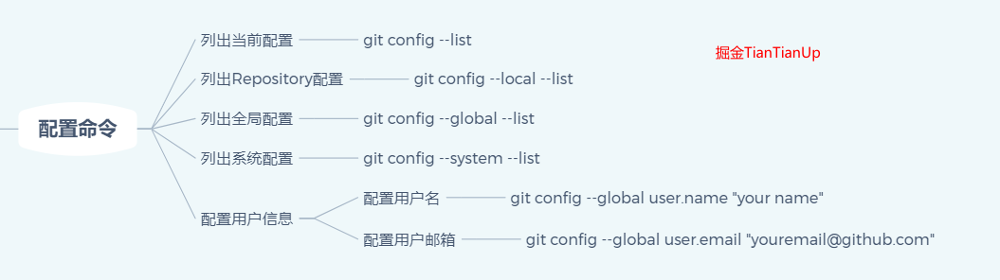
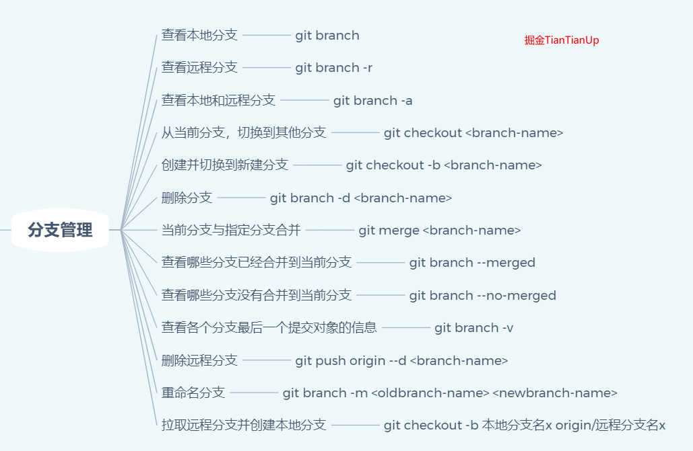
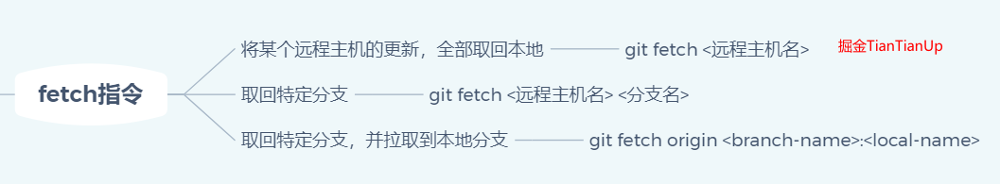
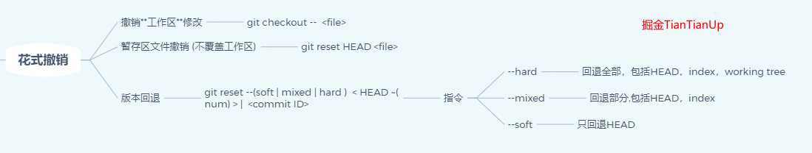
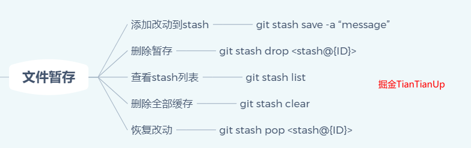
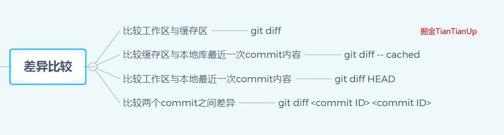
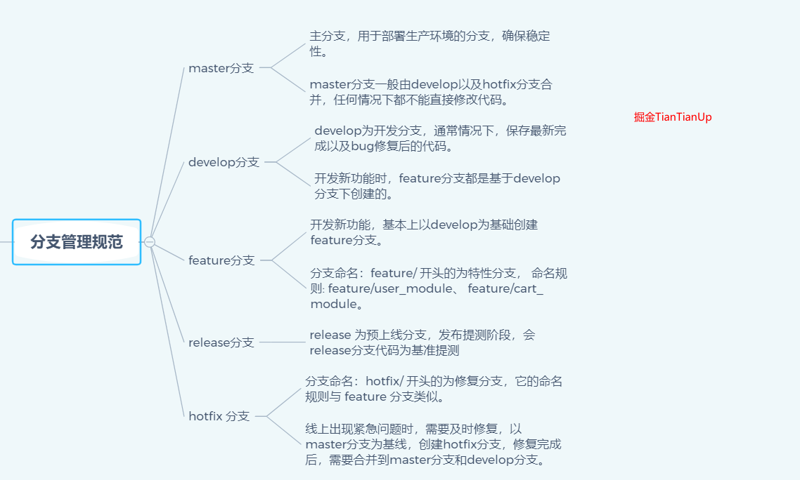

## Git命令

### 前言
---
脑图 👇


---
git操作流程图


---
### 基本概念


基于上面的图，我们就有接下来一些概念👇

- 版本库`.git`
  - 当我们使用git管理文件时，比如`git init`时，会多一个`.git`文件，我们称之为版本库。
  - `.git`文件另一个作用就是它在创建的时候，会自动创建`master`分支，并且将`HEAD`指针指向`master`分支。
- 工作区
  - 本地项目存放的位置。
  - 可以理解成图上的`workspace`。
- 暂缓区（`Index/Stage`）
  - 暂时存放文件的地方，通过`add`命令将工作区的文件添加到缓冲区。
- 本地仓库（`Repository`）
  - 使用`commit`命令可以将暂缓区的文件添加到本地仓库。
  - `HEAD`指针指向的就是`master`分支
- 远程仓库
  - 当我们使用`Github`托管项目时，它就是一个远程仓库。
  - 通常使用`clone`命令将远程仓库代码copy下来，本地代码更新后，通过push托送给远程仓库。
---
### Git文件状态
- 通常我们需要查看一个文件的状态
  ```
  git status
  ```
- `Changes not staged for commit`
  - 表示工作区有内容，但是缓存区没有，需要`git add`
- `Changes to be commited`
  - 文件放在缓存区，需要`git commit`
- `nothing to commit, working tree clean`
  - 将本地的代码推送到远端即可
---
### 常见命令
---
#### git配置命令


- 列出当前配置
  `git config --list`
- 列出Repository配置
  `git config --local --list`
- 列出全局配置
  `git config --global --list`
- 列出系统配置
  `git config --system --list`
- 配置用户名
  `git config --global user.name "your name"`
- 配置用户邮箱
  `git config --global user.email "youremail@qq.com"`
---
#### 分支管理


- 查看本地分支
  `git branch`
- 查看远程分支
  `git branch -r`
- 查看本地和远程分支
  `git branch -a`
- 从当前分支，切换到其他分支
  `git checkout <branch-name>`
  // 举个例子
  `git checkout feature/test`
- 创建并切换到新建分支
  `git checkout -b <branch-name>`
  // 举个例子
  `git checkout -b feature/test`
- 删除分支
  `git branch -d <branch-name>`
  // 举个例子
  `git branch -d feature/test`
- 当前分支与指定分支合并
  `git merge <branch-name>`
  // 举个例子
  `git merge feature/test`
- 查看哪些分支没有合并到当前分支
  `git branch --merged`
- 查看哪些分支没有合并到当前分支
  `git branch --no-merged`
- 查看各个分支最后一个提交对象的信息
  `git branch -v`
- 删除远程分支
  `git push origin -d <branch-name>`
- 重命名分支
  `git branch -m <oldbranch-name> <newbranch-name>`
- 拉去远程分支并创建本地分支
  `git checkout -b 本地分支名x origin/远程分支名x`
  // 另外一种方式
  `git fetch origin <branch-nam>:<local-branch-name>`

---
#### fetch指令


##### fetch推荐写法
`git fetch origin <branch-name>:<local-branch-name>`

- 一般而言，这个`origin`是远程主机名，一般默认就是`origin`
- `branch-name`你要拉取的分支
- `local-branch-name`本地新建一个新分支，将origin下的某个分支代码下载到本地分支

举个例子
`git fetch origin feature/test:feature/help`
// 工作目录下就会有feature/help
// 一般情况下，我们需要做的就是在这个分支上开发新需求
// 完成代码后，我们需要做的就是上传我们的分支

##### fetch其他写法
- 将某个远程主机的更新，全部取回本地
  `git fetch <远程主机名>`
- 取回特定分支，可以指定分支名
  `git fetch <远程主机名> <分支名>`
- 将某个分支的内容取回本地下某个分支
  `git fetch origin :<local-branch-name>`
  // 等价于
  `git fetch origin master:<local-branch-name>`


#### 花式撤销


- 撤销工作区修改
  - `git checkout -- <file>`
  // 此命令用来放弃掉所有还没有加入到缓存区（就是 `git add` 命令）的修改：内容修改与整个文件删除。
  // 但是此命令不会删除掉刚新建的文件。因为刚新建的文件还没已有加入到 git 的管理系统中。所以对于git是未知的。自己手动删除就好了。
  - `git checkout .`
  // 放弃所有的文件修改
- 暂缓区文件撤销（不覆盖工作区）
  - `git reset HEAD <file>`
- 版本回退
  - `git reset --(soft|mixed|hard) <HEAD ~(num)>|<commit ID>`
  
  - |指令|作用范围|
    |---|---|
    |--hard|回退部分，包括HEAD，index，working tree|
    |--mixed|回退部分，包括HEAD，index|
    |--soft|只回退HEAD|
---

#### 状态查询
- 查看状态
  `git status`
- 查看历史操作记录
  `git reflog`
- 查看日志
  `git log`

---
#### 文档查询
- 展示Git命令大纲
  `git help (--help)`
- 展示Git命令大纲全部列表
  `git help -a`
- 展示具体命令说明手册
  `git help`

#### 文档暂存


1. 当正在dev分支上开发某个项目，这时项目中出现一个bug，需要紧急修复，但是正在开发的内容只是完成一半，还不想提交，这时可以用`git stash`命令将修改的内容保存至堆栈区，然后顺利切换到hotfix分支进行bug修复，修复完成后，再次切回到dev分支，从堆栈中恢复刚刚保存的内容。
2. 由于疏忽，本应该在dev分支开发的内容，却在master上进行了开发，需要重新切回到dev分支上进行开发，可以用`git stash`将内容保存至堆栈中，切回到dev分支后，再次恢复内容即可。
总的来说，`git stash`命令的作用就是将目前还不想提交的但是已经修改的内容进行保存至堆栈中，后续可以在某个分支上恢复出堆栈中的内容。这也就是说，stash中的内容不仅仅可以恢复到原先开发的分支，也可以恢复到其他任意指定的分支上。git stash作用的范围包括工作区和暂存区中的内容，也就是说没有提交的内容都会保存至堆栈中。

- 添加改动到stash
  - `git stash save -a "message"`
- 删除暂存
  - `git stash drop <stash@{ID}>`
- 查看stash列表
  - `git stash list`
- 删除全部缓存
  - `git stash clear`
- 恢复改动
  - `git stash pop <stash@{ID}>`
  - `git stash apply`
  // 将堆栈中的内容应用到当前目录，不同于git stash pop，该命令不会将内容从堆栈中删除，也就说该命令能够将堆栈的内容多次应用到工作目录中，适应于多个分支的情况。

#### 差异比较


- 比较工作区与缓存区
  - `git diff`
- 比较缓存区与本地库最近一次commit内容
  - `git diff -- cached`
- 比较工作区与本地最近一次commit内容
  - `git diff HEAD`
- 比较两个commit之间差异
  - `git diff <commit ID><commit ID>`

### 分支命名


#### master分支
1. 主分支，用于部署生产环境的分支，确保稳定性。
2. master分支一般由develop以及hotfix分支合并，任何情况下都不能直接修改代码。
#### develop分支
1. develop为开发分支，通常情况下，保存最新完成以及bug修复后的代码。
2. 开发新功能时，feature分支都是基于develop分支下创建的。
#### feature分支
1. 开发新功能，基本上以develop为基础创建feature分支。
2. 分支命名：feature/ 开头的为特性分支， 命名规则: feature/user_module、 feature/cart_module。
#### release分支
1. release 为预上线分支，发布提测阶段，会release分支代码为基准提测。
#### hotfix分支
1. 分支命名：hotfix/ 开头的为修复分支，它的命名规则与 feature 分支类似。
2. 线上出现紧急问题时，需要及时修复，以master分支为基线，创建hotfix分支，修复完成后，需要合并到master分支和develop分支。

### 基本操作
- 创建本地仓库
  `git init`
- 链接本地仓库与远端仓库
  `git remote add origin`
  // origin默认是远端仓库别名 url可以使用https或者ssh的方式创建
- 检查配置信息
  - `git config --list`
- Git user name 与 email
  - `git config --global user.name "yourname"`
  - `git config --global user.email "youremail"`
- 生成ssh密钥
  - `ssh-keygen -t rsa -C "邮箱"`
  - `cd ~/.ssh` 里面有一个文件名为id_rsa.pub，把内容复制到git库我的SSHKEYs中
- 查看远端仓库信息
  - `git remote -v`
- 远端仓库重新命名
  - `git remote rename old new`
- 提交到缓存区
  - `git add .` 全部上传到缓存区
  - `git add 指定文件`
- 提交远程仓库
  - `git push <远程主机名> <本地分支名>:<远程分支名>`
- 查看分支
  - `git branch`
- 创建新分支
  - `git branch <name>`
- 切换分支
  - `git checkout <name>`
- 创建分支并切换
  - `git checkout -b <name>`
- 删除分支
  - `git branch -d <name>`
- 删除远程分支
  - `git push -d <name>`

### 忽略文件 .gitignore
```
# 此行为注释 会被Git忽略

# 忽略 node_modules/ 目录下所有的文件
node_modules


# 忽略所有.vscode结尾的文件
.vscode

# 忽略所有.md结尾的文件
*.md

# 但README.md 除外
!README.md

# 会忽略 doc/something.txt 但不会忽略doc/images/arch.txt
doc/*.txt

# 忽略 doc/ 目录下所有扩展名为txt文件
doc/**/*.txt
```