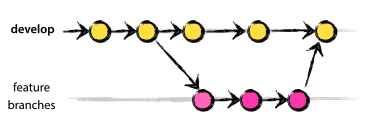
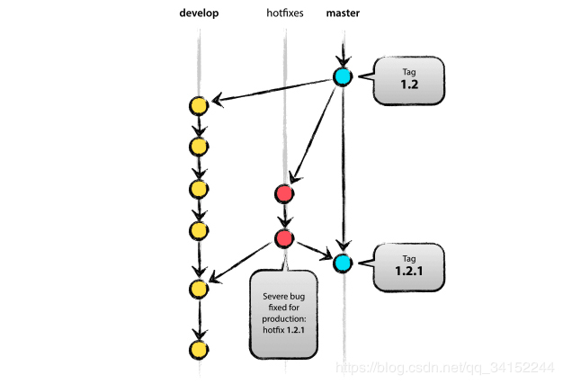
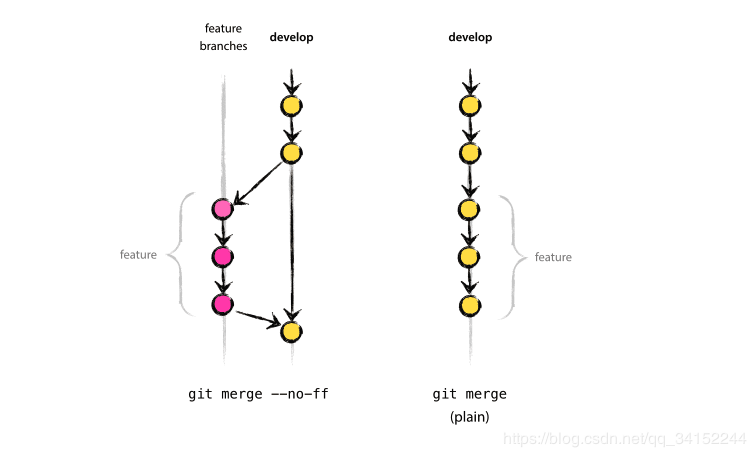
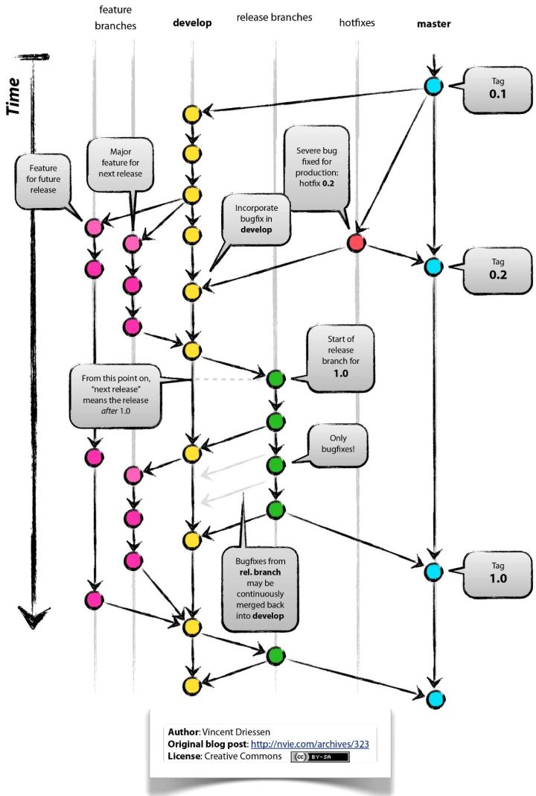

# Git分支管理策略及简单操作
1. 主分支`master`
首先，代码库应该有且仅有一个主分支。所有提供给用户使用的正式版本，都在这个主分支上发布。Git主分支的名字，默认叫做`master`。它是自动建立的，版本库初始化以后，默认就是在主分支在进行开发。团队成员从主分支(`master`)获得的都是处于可发布状态的代码。

2. 开发分支`develop`
日常开发应该在另一条分支上完成。我们把开发用的分支，叫做`develop`分支。开发分支(`develop`)应该总能够获得最新开发进展的代码。如果想正式对外发布，就在`master`分支上，对`develop`分支进行`merge`。下面介绍常用的几个命令：

# 在master分支上创建develop分支
`git checkout -b develop master`

# 切换到master分支
`git checkout master`

# 对develop分支合并到当前master分支
`git merge --no-ff develop`
3. 临时分支
除了常设分支以外，还有一些临时性分支，用于应对一些特定目的的版本开发。临时性分支主要有三种：

功能（`feature`）分支
预发布（`release`）分支
修补bug（`hotfix`）分支
这三种分支都属于临时性需要，使用完以后，最好删除，使得代码库的常设分支始终只有`master`和`develop`。

3.1 功能分支
`feature`分支是为了开发某种特定功能，从`develop`分支上面分出来的。开发完成后，要并入`develop`。功能分支的名字，可以采用`feature/xxx`的形式命名。

# 从develop创建一个功能分支
`git checkout -b feature/x develop`

# 开发完成后，将功能分支合并到develop分支：
`git checkout develop`
`git merge --no-ff feature/x`

# 删除feature分支
`git branch -d feature/x`

3.2 预发布分支
`release`分支是指发布正式版本之前（即合并到`master`分支之前），我们可能需要有一个预发布的版本进行测试而从`develop`创建的分支。预发布结束以后，必须合并进`develop`和`master`分支。它的命名，可以采用`release/xxx`的形式。

# 创建一个预发布分支
`git checkout -b release/x develop`

# 确认没有问题后，合并到master分支
`git checkout master`
`git merge --no-ff release/x`

# 对合并生成的新节点，做一个标签
`git tag -a 1.2`

# 再合并到develop分支
`git checkout develop`
`git merge --no-ff release/x`

# 最后，删除预发布分支
`git branch -d release/x`
3.3 bug修补分支
软件正式发布以后，难免会出现bug。这时就需要创建一个分支，进行bug修补。

修补bug分支是从Master分支上面分出来的。修补结束以后，再合并进`master`和`develop`分支。它的命名，可以采用`hotfix/x`的形式。

# 创建一个修补bug分支
`git checkout -b hotfix/x master`

# 修补结束后，合并到master分支
`git checkout master`
`git merge --no-ff hotfix/x`
`git tag -a 0.1`

# 再合并到develop分支
`git checkout develop`
`git merge --no-ff hotfix/x`

# 删除"修补bug分支"
`git branch -d hotfix/x`

4. 总结
上面许多指令使用的--no-ff的意思是`no-fast-farward`的缩写，使用该命令可以保持更多的版本演进的细节。如果不使用该参数，默认使用了`fast-farword`进行`merge`。两者的区别如下图所示：

最后分享一下整体的分支管理策略图示:

